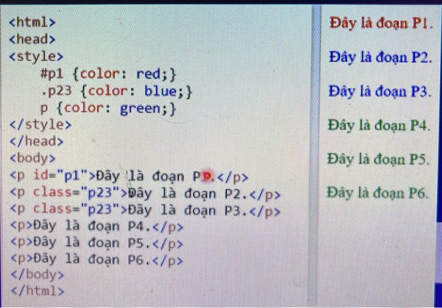

<html lang="vi">
<head>
    <meta charset="UTF-8">
    <meta name="viewport" content="width=device-width, initial-scale=1.0">
    <title>Luyện tập bài 16 Tin học 12</title>
    
</head>
<body>

    <h1>Luyện tập bài 16 Tin học 12</h1>

    
Luyện tập 1 trang 95 Tin học 12: <strong>Phần tử HTML có thể ẩn đi trên trang web được không? Nếu có thì dùng lệnh CSS gì?</strong>

    
- Phần tử HTML có thể được ẩn đi trên trang web.

    
- Để ẩn các phần tử HTML trên trang web, cần thiết lập CSS với thuộc tính <code>display</code> có giá trị <code>none</code>.

    
Luyện tập 2 trang 95 Tin học 12: <strong>Hãy giải thích ý nghĩa định dạng sau:

</strong>

    
Ý nghĩa:

    <ul>
        <li><code>test.test_more</code>: Đây là một bộ chọn đồng thời (class selector) áp dụng cho các phần tử có cả hai lớp tên là "test" và "test_more". Điều này có nghĩa là chỉ các phần tử có cả hai lớp tên này sẽ được áp dụng định dạng.</li>
        <li><code>background-color: red;</code>: Đây là thuộc tính CSS được sử dụng để đặt màu nền (background-color) của các phần tử được chọn. Trong trường hợp này, màu nền của các phần tử có lớp tên "test
<!DOCTYPE html>
<html lang="vi">
<head>
    <meta charset="UTF-8">
    <meta name="viewport" content="width=device-width, initial-scale=1.0">
    <title>Luyện tập Tin học 12</title>
    
</head>
<body>

    <h1> Giải bài tập Tin học 12 bài 17 </h1>

    
Luyện tập 1 trang 101 Tin học 12: <strong>Giải thích sự khác nhau giữa hai định dạng sau:</strong>

    
• <code>#p123 + p {color: red;}</code>: áp dụng cho phần tử <code>p</code> với điều kiện phần tử <code>p</code> nằm ngay sau phần tử bất kì có mã định danh <code>#p123</code>.

    
• <code>h2#p123 + p {color: red;}</code>: áp dụng cho phần tử <code>p</code> với điều kiện phần tử <code>p</code> nằm ngay sau phần tử <code>h2</code> có mã định danh <code>#p123</code>.

    
Luyện tập 2 trang 101 Tin học 12: <strong>Trong phần Thực hành, các tên riêng (tên người, tên tổ chức) cần được bổ sung định dạng đóng khung và in nghiêng. Em sẽ thực hiện các yêu cầu này như thế nào?</strong>

    
• Đưa các tên riêng vào thẻ <code>&lt;em&gt;</code>.....<code>&lt;/em&gt;</code>.

    
• Tạo mẫu định dạng CSS cho phần tử <code>&lt;em&gt;</code>: <code>em {font-style: italic; border: 1px solid blue;}</code>.

    
Vận dụng 1 trang 101 Tin học 12: <strong>Tìm hiểu thêm các dạng pseudo-class khác, nêu ý nghĩa và tìm ví dụ ứng dụng thực tế cho các kiểu bộ chọn này:</strong>

    <ul>
        <li><strong>:hover</strong> - Dạng pseudo-class này được kích hoạt khi người dùng di chuột qua một phần tử. Nó cho phép em áp dụng các định dạng CSS khi phần tử đang được hover.</li>
        <li><strong>:active</strong> - Dạng pseudo-class này được kích hoạt khi phần tử đang được nhấn (khi người dùng giữ chuột trái). Em có thể sử dụng nó để áp dụng các định dạng CSS khi phần tử đang ở trạng thái active.</li>
        <li><strong>:focus</strong> - Dạng pseudo-class này được kích hoạt khi phần tử đang trong trạng thái focus (thường xảy ra khi người dùng click hoặc sử dụng phím tab để di chuyển đến phần tử). Em có thể sử dụng nó để áp dụng các định dạng CSS khi phần tử đang trong trạng thái focus.</li>
        <li><strong>:nth-child()</strong> - Dạng pseudo-class này cho phép em chọn các phần tử con trong một phần tử cha dựa trên vị trí của chúng. Em có thể sử dụng nó để áp dụng các định dạng CSS cho phần tử con cụ thể.</li>
    </ul>

    
Vận dụng 2 trang 101 Tin học 12: <strong>Tìm hiểu thêm các dạng pseudo-element khác, nêu ý nghĩa và tìm ví dụ ứng dụng thực tế cho các kiểu bộ chọn này:</strong>

    <ul>
        <li><strong>::before</strong> - Dạng pseudo-element này cho phép em chèn nội dung vào phần tử trước nội dung chính của nó. Em có thể sử dụng nó để thêm các biểu tượng, ký hiệu hoặc phần tử trang trí trước một phần tử.</li>
        <li><strong>::after</strong> - Dạng pseudo-element này cho phép em chèn nội dung vào phần tử sau nội dung chính của nó. Em có thể sử dụng nó để thêm các phần tử trang trí hoặc hiệu ứng sau một phần tử.</li>
        <li><strong>::first-line</strong> - Dạng pseudo-element này cho phép em áp dụng các định dạng CSS cho dòng đầu tiên của một phần tử chứa nội dung văn bản. Em có thể sử dụng nó để thay đổi kiểu chữ, khoảng cách dòng hoặc các thuộc tính khác cho dòng đầu tiên.</li>
    </ul>

</body>
</html>     
<head>
    <meta charset="UTF-8">
    <meta name="viewport" content="width=device-width, initial-scale=1.0">
    <title>Luyện tập Tin học 12</title>
    
</head>
<body>

    <h1> Giải bài tập Tin học 12 bài 18 </h1>

    
Luyện tập 1 trang 105 Tin học 12: <strong>Tạo trang dang_ki.html chứa biểu mẫu đăng kí câu lạc bộ và bổ sung liên kết tới trang dang_ki trong phần cuối trang của tất cả các trang.</strong>

    
Để tạo trang "dang_ki.html" chứa biểu mẫu đăng kí câu lạc bộ và bổ sung liên kết tới trang "dang_ki" trong phần cuối trang của tất cả các trang, em có thể làm như sau:

    <ul>
        <li>Tạo tệp tin HTML mới và đặt tên là "dang_ki.html".</li>
        <li>Trong tệp tin "dang_ki.html", tạo biểu mẫu đăng kí câu lạc bộ bằng cách sử dụng các phần tử HTML như <code>&lt;form&gt;</code>, <code>&lt;input&gt;</code>, và <code>&lt;button&gt;</code>. Thiết kế biểu mẫu theo yêu cầu của em, bao gồm các trường nhập thông tin và nút gửi đăng kí.</li>
        <li>Sau khi hoàn thành biểu mẫu, em có thể thêm CSS để định dạng giao diện biểu mẫu theo ý muốn. Sử dụng các lớp CSS để tạo kiểu cho các phần tử trong biểu mẫu.</li>
        <li>Sau khi tạo xong trang "dang_ki.html", em cần bổ sung liên kết tới trang "dang_ki" trong phần cuối trang của tất cả các trang khác trong website.</li>
    </ul>

    
Luyện tập 2 trang 105 Tin học 12: <strong>Thay đổi định dạng và màu sắc của phông chữ trong các vùng khi di chuyển chuột qua.</strong>

    
Để thay đổi định dạng và màu sắc của phông chữ trong các vùng khi di chuyển chuột qua, em có thể sử dụng hiệu ứng hover trong CSS.

    
Ví dụ: Khi di chuột qua đoạn văn này, phông chữ sẽ thay đổi màu sắc và kiểu định dạng.

    
Vận dụng trang 105 Tin học 12: <strong>Hãy đưa ra một thiết kế khác cho website đã tạo ở phần Thực hành. Viết định dạng theo thiết kế mới và chuyển toàn bộ website sang định dạng mới.</strong>

    
Để áp dụng thiết kế mới cho trang web đã tạo trong phần Thực hành, em cần thực hiện các bước sau:

    <ul>
        <li>Tạo một tệp CSS mới và đặt tên là "style.css" (hoặc tên tùy chọn khác).</li>
        <li>Trong tệp CSS, thêm mã CSS để định dạng các phần tử theo thiết kế mới.</li>
        <li>Cập nhật tất cả các trang web trong dự án để sử dụng tệp CSS mới bằng cách thêm liên kết tới tệp CSS trong thẻ <code>&lt;head&gt;</code>.</li>
    </ul>

<footer>
    
© 2025 Tin học 12 | <a href="dang_ki.html">Trang Đăng Kí</a>

